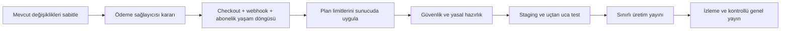

# Systemcel — Kalan İşler ve Yayına Çıkış Planı

> Son güncelleme: 28 Temmuz 2026
> Durum: Kod deposu incelenerek hazırlanmış güncel icra planı
> Kapsam: Landing page, abonelikler, muhasebeci ürünü, güvenlik, test, operasyon ve yayın

## 1. Bu belgenin amacı

Bu dosya bundan sonraki işler için ana kontrol listesi olacaktır. `plan.md` projenin dönüşüm geçmişini ve ilk mimari kararları anlatmaya devam eder; tamamlanmış ve güncelliğini yitirmiş maddeler nedeniyle aktif iş takibi için kullanılmamalıdır.

Öncelik sınıfları:

- **P0 — Yayın engelleyici:** Ücretli kullanıcı almadan veya üretime çıkmadan önce tamamlanmalı.
- **P1 — İlk sürüm:** İlk kararlı sürümün hemen ardından veya sınırlı beta sırasında tamamlanmalı.
- **P2 — Yol haritası:** Pazarlama metninde açıkça “yakında” denmeli ya da özellik hazır olana kadar vaat edilmemeli.

Eforlar tek geliştirici için yaklaşık aktif çalışma günüdür; sağlayıcı onayı, hukuk görüşü ve mağaza/altyapı bekleme sürelerini içermez.

## 2. Bugün hazır olan temel

Aşağıdaki parçalar mevcut ve yeniden yapılmayacak:

- React + Vite web arayüzü, ASP.NET Core API ve PostgreSQL çalışma yapısı.
- Clerk tabanlı kimlik doğrulama ve işletme bağlamı.
- Gelir/gider, cari, stok, fatura, tahsilat/ödeme, raporlar, GİB, Telegram ve AI modülleri.
- Muhasebeci başvurusu, yönetici onayı, pazar yeri profili, müşteri talebi ve sohbet altyapısı.
- İşletmeler ve muhasebeciler için ayrı fiyat kartları; aylık/yıllık görünüm ve TR/EN landing page.
- İşletmeler için kredi kartsız 30 günlük deneme başlatma temeli.
- Güncel plan kataloğu:
  - İşletme: Start ₺490/ay, Growth ₺990/ay, Enterprise ₺1.990/ay.
  - Muhasebeci: Ücretsiz, Standart ₺699/ay, Pro ₺1.199/ay.
  - Muhasebeci yıllık planları aylık toplamın %16 indirimli karşılığıdır.
- Abonelik/deneme dönem alanları ve herkese açık plan API'si.
- AI kullanım kotasının sunucu tarafında kontrolü.
- Pro muhasebecilerin pazar yeri sıralamasında öne alınması.
- Masaüstü veri paketi için manifest/hash doğrulayan ve işlemsel çalışan içe aktarma servisi.
- Windows CI içinde frontend derleme ve .NET test çalıştırma temeli.

## 3. Kritik yol

Ödeme, hak kontrolü ve staging testi tamamlanmadan ücretli plan butonları gerçek satışa açılmamalıdır.

---

## 4. P0 — Yayın engelleyici işler

### P0.1 — Mevcut fiyatlandırma değişikliklerini sabitle

**Amaç:** Şu an çalışma ağacındaki fiyatlandırma, landing page ve veritabanı değişikliklerini güvenli bir başlangıç noktasına dönüştürmek.

**Etkilenen mevcut dosyalar:**

- `CashTracker.Core/Entities/Abonelik.cs`
- `CashTracker.Core/Entities/IsletmeDeneme.cs`
- `CashTracker.Core/Models/SubscriptionPlanCatalog.cs`
- `CashTracker.Core/Models/SubscriptionEntitlementStatus.cs`
- `CashTracker.Infrastructure/Services/SubscriptionEntitlementService.cs`
- `CashTracker.Infrastructure/Persistence/Migrations/PostgreSql/20260721172509_SubscriptionPlan2026.cs`
- `CashTracker.Infrastructure/Persistence/Migrations/PostgreSql/CashTrackerDbContextModelSnapshot.cs`
- `Systemcel.Api/Api/SubscriptionApi.cs`
- `Systemcel.Web/src/marketing/LandingPage.tsx`
- `Systemcel.Web/src/marketing/marketing.css`

**Yapılacaklar:**

- [x] `SubscriptionPlan2026` migration SQL'ini üret ve yalnızca beklenen kolon/değişikliklerin geldiğini incele. (21 Temmuz 2026: üç `ALTER TABLE`, veri backfill'i ve migration history kaydı doğrulandı.)
- [ ] Boş bir PostgreSQL veritabanına tüm migration zincirini baştan uygula.
- [ ] Üretim şemasının anonimleştirilmiş/staging kopyasında ileri migration denemesi yap.
- [ ] Eski abonelik ve deneme kayıtlarının varsayılan dönem/tutar davranışını doğrula.
- [ ] API'yi yeniden başlatıp aylık ve yıllık plan JSON yanıtlarını kontrol et.
- [ ] Landing page'de işletme/muhasebeci, aylık/yıllık ve TR/EN kombinasyonlarını elle doğrula.
- [x] Backend testleri ve production frontend build'i yeniden çalıştır. (21 Temmuz 2026: 68/68 test geçti; Vite production build başarılı.)
- [x] Doğrulanan değişiklikleri tek bir checkpoint commit'inde topla. (21 Temmuz 2026: `7efde58`.)

**Kabul kriteri:** Migration hem boş hem mevcut şemada veri kaybı olmadan uygulanır; yıllık toplamlar API ve arayüzde sıfır görünmez; build ve testler yeşildir.

**Tahmini efor:** 1–2 gün.

### P0.2 — Ödeme sağlayıcısı ve ticari kuralları kararlaştır

**Amaç:** Kod yazmadan önce para hareketinin tek ve denetlenebilir kural setini belirlemek.

**Karar kaydı oluştur:** `docs/adr/ADR-001-odeme-saglayicisi.md`

**Karar verilmesi gerekenler:**

- [x] Türkiye merkezli kart/tekrarlayan ödeme sağlayıcısı: **PayTR**. (22 Temmuz 2026: Şirket kuruluşu ve PayTR üye işyeri onayı bekleniyor; karar kaydı `docs/adr/ADR-001-odeme-saglayicisi.md`.)
- [x] İşletme denemesi: kart zorunlu, 30 gün; iptal edilmezse seçilen aylık plan otomatik başlar.
- [x] Muhasebeci denemesi: kart zorunlu, 14 gün; ücretsiz muhasebeci planı olmayacak ve iptal edilmezse seçilen aylık plan otomatik başlar.
- [ ] Aylık/yıllık yükseltme, düşürme ve dönem ortası fiyat farkı kuralı.
- [x] İptal dönem sonunda yürürlüğe girecek; mevcut ücretli dönem kullanılacak, sonraki dönem çekilmeyecek.
- [x] Başarısız tahsilatta 7 gün tolerans; 1., 3. ve 5. gün yeniden deneme.
- [x] İade kuralı: kanunen zorunlu haller, mükerrer tahsilat ve Systemcel kaynaklı hizmet kusurları dışında dönemsel iade yok; nihai metin hukuk onayına bağlı.
- [x] Fiyatlar KDV hariç gösterilecek; checkout ara toplam, KDV ve genel toplamı ayrı gösterecek.
- [x] Standart muhasebeci planında 10 müşteri sonrası kapasite beşli paketlerle satılacak: aylık ₺250; yıllık %16 indirimle ₺2.520, kalan süreye göre orantılı tahsilat.
- [x] Kalıcı ücretsiz plan yalnızca işletmelere sunulacak: 1 işletme, 1 kullanıcı, aylık 100 gelir/gider, 20 cari, 50 ürün/hizmet, temel stok/rapor ve manuel fatura taslağı; AI, resmî e-Belge, banka, Telegram otomasyonu ve gelişmiş dışa aktarım yok.

**Deneme dönüşüm onayı:**

- [ ] Kart eklenirken deneme bitiş tarihi, sonraki aylık ücret ve KDV açıkça gösterilsin.
- [ ] “Deneme sonunda iptal etmezsem aylık ₺X + KDV tahsil edilmesini onaylıyorum” için ayrı onay alınsın.
- [ ] Onay metni/sürümü, kullanıcı, işletme, zaman ve gerekli ispat kayıtları saklansın.
- [ ] Deneme bitmeden 7 ve 3 gün önce uygulama içi + e-posta bildirimi gönderilsin.
- [ ] Deneme sırasında iptal eden kullanıcı deneme sonuna kadar devam etsin ve kartından ücret çekilmesin.

**Kabul kriteri:** Ürün, finans ve yazılım açısından belirsiz alan bırakmayan onaylı ADR.

**Tahmini efor:** 0,5–1 gün + sağlayıcı/hukuk bekleme süresi.

### P0.3 — Gerçek abonelik ve ödeme yaşam döngüsünü kur

**Amaç:** Fiyat kartındaki seçimden tahsilat, yenileme, iptal ve hak güncellemesine kadar tam akış.

**Önerilen yeni çekirdek parçalar:**

- `CashTracker.Core/Entities/OdemeOlayi.cs` — webhook idempotency ve denetim kaydı.
- `CashTracker.Core/Entities/OdemeIslemi.cs` — tahsilat/iade/başarısızlık geçmişi.
- `CashTracker.Core/Services/IPaymentProvider.cs` — sağlayıcıdan bağımsız arayüz.
- `CashTracker.Core/Services/ISubscriptionLifecycleService.cs` — abonelik durum makinesi.
- `CashTracker.Infrastructure/Payments/<Saglayici>PaymentProvider.cs`
- `Systemcel.Api/Api/BillingApi.cs`
- `CashTracker.Infrastructure/Persistence/Migrations/PostgreSql/<timestamp>_BillingLifecycle.cs`

**Yapılacaklar:**

- [ ] Checkout oturumu oluşturma endpoint'i.
- [ ] `plan` ve `billing` değerlerini yalnızca sunucudaki katalogdan çöz; istemciden gelen fiyata güvenme.
- [ ] Webhook imzasını doğrula.
- [ ] Webhook olay kimliğine benzersiz indeks koy ve tekrar gelen olayı zararsız biçimde kabul et.
- [ ] Başarılı ödeme, başarısız ödeme, yenileme, iptal, iade ve süre sonu durumlarını işle.
- [ ] Sağlayıcı müşteri/abonelik/ödeme referanslarını sakla.
- [ ] Checkout dönüşünde sadece webhook ile doğrulanmış sonucu aktif kabul et.
- [ ] Kullanıcıya abonelik özeti, sonraki yenileme tarihi, ödeme geçmişi ve iptal düğmesi göster.
- [ ] Yönetici için ödeme olayı ve hata inceleme görünümü ekle.
- [ ] Günlük mutabakat işiyle sağlayıcı ve yerel durum farklarını tespit et.

**Kabul kriteri:** Aynı webhook 10 kez gelse de tek işlem oluşur; başarılı ödeme hakkı açar, başarısız ödeme açmaz; iptal/dönem sonu kuralları ADR ile birebir çalışır.

**Testler:** Birim durum-makinesi testleri, sahte sağlayıcı sözleşme testleri, webhook entegrasyon testleri ve sandbox uçtan uca ödeme testi.

**Tahmini efor:** 5–8 gün.

### P0.4 — Landing page plan seçimini uygulamaya bağla

**Mevcut açık:** Muhasebeci CTA'sı `plan` ve `billing` sorgu parametreleri üretse de uygulama bu değerleri henüz tüketmiyor. İşletme tarafı deneme başlatabiliyor; ücretliye geçiş yok.

**Etkilenen dosyalar:**

- `Systemcel.Web/src/marketing/LandingPage.tsx`
- `Systemcel.Web/src/App.tsx`
- `Systemcel.Web/src/auth/AuthSayfasi.tsx`
- `Systemcel.Web/src/screens/welcome/WelcomeSayfasi.tsx`
- `Systemcel.Web/src/screens/muhasebeci/MuhasebeciPanelSayfasi.tsx`
- yeni: `Systemcel.Web/src/screens/billing/AbonelikSayfasi.tsx`
- yeni: `Systemcel.Web/src/screens/billing/api.ts`

**Yapılacaklar:**

- [ ] Seçilen hedef kitle, plan ve dönem değerlerini giriş/kayıt boyunca güvenli biçimde koru.
- [ ] Girişten sonra işletmeyi kolay kuruluma/denemeye, muhasebeciyi başvuru veya checkout akışına yönlendir.
- [ ] Kullanıcının rolüne uymayan planı sunucu tarafında reddet.
- [ ] Ücretsiz, deneme, ücretli ve zaten-abone kullanıcıların düğme davranışlarını ayır.
- [ ] Checkout iptal/başarı/hata ekranlarını ekle.
- [ ] Çift tıklama ve ağ tekrarında birden çok checkout oluşmasını engelle.

**Kabul kriteri:** Her fiyat kartı beklenen ve geri dönülebilir akışı başlatır; ölü düğme veya boşa düşen sorgu parametresi kalmaz.

**Tahmini efor:** 2–3 gün; P0.3'e bağlıdır.

### P0.5 — Plan haklarını gerçekten uygula

**Mevcut açık:** AI kotası uygulanıyor; fatura, kullanıcı, müşteri ve gelişmiş özellik bayraklarının çoğu katalog/yanıt düzeyinde kalıyor.

**Önerilen yapı:**

- `CashTracker.Core/Services/IEntitlementGuard.cs`
- `CashTracker.Infrastructure/Services/EntitlementGuard.cs`
- API hata kodları: `subscription_required`, `limit_reached`, `feature_not_available`.

**Yapılacaklar:**

- [ ] Fatura oluştururken dönemsel `FaturaLimiti` kontrolü.
- [ ] İşletme üyesi davet ederken `KullaniciLimiti` kontrolü.
- [ ] Muhasebeci müşteri daveti/kabulünde `MusteriLimiti` kontrolü.
- [ ] İşletme ücretsiz planının 1 işletme/1 kullanıcı, aylık 100 gelir-gider, 20 cari ve 50 ürün/hizmet sınırlarını transaction-safe uygula.
- [ ] İşletme ücretsiz planında AI, resmî e-Belge, banka, Telegram otomasyonu ve gelişmiş dışa aktarımı sunucu tarafında kapat.
- [ ] Muhasebeci ücretsiz planını katalogdan ve landing page'den kaldır; mevcut ücretsiz muhasebeciler için veri kaybetmeyen deneme/plan seçme geçişi tanımla.
- [ ] AI kotasını ortak hata sözleşmesine geçir.
- [ ] Stok raporu, banka mutabakatı, çoklu şube, çoklu para birimi, API erişimi ve öncelikli destek için ya gerçek gate ekle ya da özelliği landing page'den kaldır/“yakında” işaretle.
- [ ] Yükseltme gerektiğinde arayüzde açıklayıcı modal ve doğru plana yönlendirme göster.
- [ ] Sayım ile oluşturma işlemini aynı transaction içinde yaparak eşzamanlı limit aşımını önle.
- [ ] Yönetici override/manuel hak değişikliklerini denetim kaydına bağla.

**Etkilenen servisler:**

- `CashTracker.Infrastructure/Services/FaturaService.cs`
- `CashTracker.Infrastructure/Services/IsletmeService.cs`
- `CashTracker.Infrastructure/Services/MuhasebeciPortalService.cs`
- `CashTracker.Infrastructure/Services/AiUsageQuotaService.cs`
- ilgili `Systemcel.Api/Api/*.cs` endpoint'leri.

**Kabul kriteri:** Limitler sadece arayüzde değil API'de de aşılamaz; plan değişince yeni haklar gecikmeden ve tutarlı biçimde görünür.

**Tahmini efor:** 4–6 gün.

### P0.6 — Deneme süresi ve abonelik sona erme deneyimi

**Yapılacaklar:**

- [ ] Denemenin bitmesine 7 ve 3 gün kala uygulama içi + e-posta bildiriminde bitiş tarihi, çekilecek aylık tutar + KDV, iptal yolu ve iptal edilmezse ücretli aylık aboneliğin başlayacağı açıkça gösterilsin.
- [ ] Deneme bitince veri silmeden salt-okunur veya seçilen kısıtlı moda geçiş.
- [ ] “Plan seç” ve “ödeme yöntemini düzelt” ekranları.
- [ ] Süresi dolmuş deneme için tekrar deneme başlatmayı sunucuda engelle.
- [ ] Yenileme/sonlandırma işlerini çalışan güvenilir bir background job'a taşı.
- [ ] Saat dilimini sadece gösterimde Europe/Istanbul kullan; depolama ve hesapları UTC standardına getir.

**Kabul kriteri:** Tarihi değiştirilen test senaryolarında aktif → yaklaşan bitiş → süresi doldu → ödeme ile aktif geçişleri veri kaybı olmadan çalışır.

**Tahmini efor:** 2–4 gün.

### P0.7 — Güvenlik sertleştirmesi

**Kritik açık:** `Systemcel.Api/Program.cs`, Windows dışında `Base64SecretProtector` kullanıyor. Base64 şifreleme değildir; buluttaki GİB/parola benzeri sırlar bu şekilde korunmamalıdır.

**Yapılacaklar:**

- [ ] Linux/üretim için ASP.NET Data Protection + kalıcı anahtar deposu veya yönetilen KMS tabanlı gerçek şifreleme ekle.
- [ ] Mevcut Base64 kayıtları için tek seferlik güvenli geçiş planı oluştur.
- [ ] Global `ProblemDetails`/exception handler ekle; stack trace'i istemciye gönderme.
- [ ] Auth, deneme başlatma, checkout, webhook dışındaki hassas endpoint ve dosya yüklemelerine uygun rate limit ekle.
- [ ] HSTS, HTTPS yönlendirme, güvenlik başlıkları ve daraltılmış CORS politikalarını üretimde doğrula.
- [ ] Chat eki ve profil resmi için uzantıdan bağımsız MIME/imza, boyut ve güvenli dosya adı kontrolleri.
- [ ] Desktop import için sıkıştırılmış/açılmış boyut, dosya sayısı ve zip-bomb limitleri; büyük paketi belleğe tamamen alma.
- [ ] Import kodunu yerel JSON dosyası yerine PostgreSQL/dağıtık depoya taşı; süre, tek kullanım ve kullanıcı/işletme sahipliğini zorla.
- [ ] Bağımlılık zafiyet taraması ve secret scan'i CI'a ekle.
- [ ] Yetkilendirme testlerinde başka işletmenin kimlikleriyle çapraz erişimi dene.

**Kabul kriteri:** Üretimde geri çözülebilir sırlar gerçek anahtarla şifrelidir; tenant kaçışı, sınırsız yükleme ve tekrar kullanılan import kodu testleri başarısız olur.

**Tahmini efor:** 4–7 gün.

### P0.8 — Yasal ve ticari metinleri tamamla

**Mevcut açık:** `Systemcel.Web/src/auth/legalTexts.ts` içinde üretim öncesi ekleneceği belirtilen veri sorumlusu unvan/adres/iletişim alanları var. İletişim alan adları da sayfalar arasında tutarlı değil.

**Yapılacaklar:**

- [ ] Şirket unvanı, MERSİS/vergi bilgisi, adres, KEP/e-posta ve destek kanalını kesinleştir.
- [ ] KVKK aydınlatma, açık rıza gerektiren işlemler, gizlilik ve kullanım koşullarını hukuk onayından geçir.
- [ ] Mesafeli hizmet/satış, iptal-iade ve abonelik yenileme metinlerini ödeme akışına ekle.
- [ ] Çerez envanterini çıkar; gerekli ise tercih yönetimi ve onay kaydı ekle.
- [ ] `systemcel.app` / `systemcel.com` iletişim tercihini tekleştir.
- [ ] Fiyatların KDV durumunu landing page ve checkout'ta açık yaz.
- [ ] Metin sürümü, kabul zamanı ve kullanıcı kimliğini kayıt altında tut.

**Kabul kriteri:** Placeholder kalmaz; kayıt ve ödeme öncesi doğru metin/sürüm gösterilir ve kabul kanıtı saklanır.

**Tahmini teknik efor:** 1–2 gün + hukuk süresi.

### P0.9 — Test, staging ve yayın kapısı

**Yapılacaklar:**

- [ ] Üretime benzeyen ayrı staging API, web ve PostgreSQL ortamı kur.
- [ ] Frontend için Vitest + React Testing Library temeli ve kritik bileşen testleri ekle.
- [ ] Playwright ile kayıt → işletme kurulum → deneme → checkout → plan hakkı → iptal ana akışını test et.
- [ ] API için gerçek PostgreSQL üzerinde entegrasyon testleri ekle.
- [ ] Webhook tekrar sırası, gecikmesi ve sahte imza senaryolarını test et.
- [ ] 1366/1920 masaüstü, tablet ve mobil görünüm; klavye ve reduced-motion kontrolleri.
- [ ] CI'a lint/typecheck, frontend test, Docker build, migration doğrulama ve güvenlik taraması ekle.
- [ ] Veritabanı yedeği alıp staging'e geri yükleme tatbikatı yap.
- [ ] Yayın/geri dönüş runbook'u oluştur: `docs/runbooks/release.md`.
- [ ] Sınırlı kullanıcı grubuyla smoke test; ardından genel yayın kararı.

**Kabul kriteri:** Kritik E2E akışı otomatik geçer; migration ve Docker imajı CI'da doğrulanır; geri dönüş adımları denenmiştir.

**Tahmini efor:** 4–7 gün.

### P0.10 — Mobil kimlik doğrulama ve sohbet regresyonlarını gider

**Amaç:** Mobil kayıt/giriş ve sohbet deneyimindeki mevcut üretim hatalarını, yeni özellik çalışmalarından önce kararlı hale getirmek.

#### P0.10.1 — Mobil kayıt ekranını yeniden düzenle

**Mevcut sorun:** Mobil kayıt ekranında form sütunu aşırı daralıyor; başlık, açıklama, rol seçici, butonlar ve alanlar kelime kelime kırılıyor. Ekranın kullanılabilir genişliği değerlendirilmiyor ve yatay/dikey yerleşim masaüstü kurallarından etkileniyor.

**Görsel yön:** `1000100572.jpg` mevcut hatayı, `codex-clipboard-a3078783-876a-45ea-af7d-2e2a1aaa2ebc.png` hedeflenen daha temiz mobil hiyerarşiyi gösterir. Hedef görsel birebir kopyalanmayacak; Systemcel'in krem, siyah ve lime tasarım dili korunarak genişlik, boşluk, tipografi ve form hiyerarşisi referans alınacaktır.

**Etkilenen ana dosyalar:**

- `Systemcel.Web/src/auth/AuthSayfasi.tsx`
- `Systemcel.Web/src/styles.css`
- `Systemcel.Web/src/auth/AuthGate.tsx`

**Yapılacaklar:**

- [x] Mobilde masaüstünden kalan sabit/dar sütun genişliklerini kaldır; formu kullanılabilir ekran genişliğine yay.
- [x] Logo ve dil seçiciyi tek, dengeli bir üst satırda tut.
- [x] Başlık, açıklama, Google butonu, ayırıcı, rol seçici ve form alanları arasında net bir dikey hiyerarşi kur.
- [x] İşletme/Muhasebeci rol seçicisinin metinlerinin üst üste binmesini ve taşmasını engelle.
- [x] Form alanlarını en az 44 px dokunma yüksekliğiyle, okunabilir placeholder ve parola görünürlük kontrolüyle düzenle.
- [x] Kayıt/giriş/yasal metin bağlantılarının ekranın altına veya tarayıcı çubuğunun arkasına sıkışmamasını sağla.
- [x] İlk HTML/CSS yüklenirken eski mavi tema veya genişlik sıçraması göstermediğini doğrula.
- [ ] 320, 360, 375, 390 ve 430 px genişliklerde; iOS Safari ve Android Chrome görünümünde kontrol et.

**Kabul kriteri:** Hiçbir metin harf/kelime sütununa dönüşmez, yatay taşma oluşmaz, rol seçenekleri çakışmaz, tüm alanlar ve ana CTA tek elle kullanılabilir kalır; ekran hedef görseldeki kadar açık ve taranabilir bir hiyerarşiye sahip olur.

#### P0.10.2 — Sohbet arşiv durumunu tekilleştir

**Mevcut sorun:** Bir sohbet arşivden çıkarılıp tekrar arşivlendiğinde hem normal hem arşiv görünümünde kalabiliyor. SignalR bildirimi, liste yenileme ve açık sohbet yenilemesi aynı anda çalıştığında eski durum yeni durumu ezebiliyor.

**Etkilenen ana dosyalar:**

- `Systemcel.Web/src/screens/sohbetler/SohbetlerSayfasi.tsx`
- `CashTracker.Infrastructure/Services/MuhasebeciSohbetMerkeziService.cs`
- `Systemcel.Api/Api/SohbetMerkeziApi.cs`

**Yapılacaklar:**

- [x] Aktif ve arşiv görünümünün sorgu anlamını açıkça ayır (`active`, `archived`, gerekirse `all`); “Arşivlenenleri göster” davranışını belirsiz bırakma.
- [x] Sohbet listesini `sohbetId` üzerinden tekilleştir; aynı konuşmanın aynı anda iki listede veya iki kart olarak görünmesini engelle.
- [x] Arşivle/arşivden çıkar işleminden sonra sunucudan dönen son durumu tek doğruluk kaynağı kabul et.
- [x] Eski liste isteği, polling veya SignalR yanıtının daha yeni arşiv durumunu geri çevirmesini istek sırası/sürüm kontrolüyle engelle.
- [x] Açık sohbet arşivlenince aktif görünümden kaldır; arşiv görünümündeyse yerinde ve tek kayıt olarak güncelle.
- [x] Yeni karşı taraf mesajının arşivden çıkarma kuralını koru; yalnızca okuma/yenileme işleminin arşivi değiştirmediğini doğrula.
- [ ] Arşivle → çıkar → tekrar arşivle döngüsünü hızlı ve tekrarlı tıklamalarla otomatik test et.

**Kabul kriteri:** Her `sohbetId` ekranda en fazla bir kez görünür; aktif ve arşiv durumları karşılıklı olarak tutarlıdır; sayfa yenileme, hızlı tıklama, polling ve SignalR sonrasında durum geri sıçramaz.

#### P0.10.3 — Mobilde erişilebilir hesap ve çıkış akışı ekle

**Mevcut sorun:** Kullanıcı mobilde hesaba girdikten sonra görünür ve güvenilir bir “Çıkış yap” yoluna ulaşamıyor.

**Etkilenen ana dosyalar:**

- `Systemcel.Web/src/auth/AuthUserButton.tsx`
- `Systemcel.Web/src/shared/ReactWorkspaceShell.tsx`
- `Systemcel.Web/src/App.tsx`
- `Systemcel.Web/src/styles.css`

**Yapılacaklar:**

- [x] Mobil uygulama kabuğunda profil/hesap menüsünü her ana ekrandan erişilebilir yap.
- [x] Hesap menüsünde kullanıcı adı/e-posta, hesap veya profil bağlantısı ve açıkça adlandırılmış “Çıkış yap” eylemi göster.
- [x] Çıkış eylemini alt navigasyon, sayfa içeriği ve açık klavye tarafından kapatılamayan bir sheet/menu içinde sun.
- [x] Clerk oturumunu gerçekten sonlandır; yerel kullanıcı/işletme bağlamını temizle ve `/giris` sayfasına yönlendir.
- [ ] Geri tuşuyla korumalı uygulama ekranına dönülemediğini doğrula.
- [ ] 320–430 px genişliklerde ve tüm mobil çalışma alanı rotalarında erişilebilirlik testi yap.

**Kabul kriteri:** Oturum açmış kullanıcı herhangi bir mobil ana ekrandan en fazla iki dokunuşla çıkış yapabilir; çıkıştan sonra korumalı API ve ekranlara erişemez.

#### P0.10.4 — Eski mavi tema kalıntılarını temizle

**Mevcut sorun:** Muhasebeci ekranı, Ayarlar, GİB Portal ve Telegram ekranlarında eski tasarım sisteminden kalan mavi yüzey, vurgu, input, buton veya yükleme durumları bulunuyor. Bu parçalar uygulamanın krem, siyah ve lime Systemcel diliyle görsel olarak kopuk duruyor.

**Etkilenen ana alanlar:**

- `Systemcel.Web/src/screens/muhasebeci/*`
- `Systemcel.Web/src/screens/settings/*`
- GİB Portal ayar ekranı ve ilgili ortak bileşenler
- Telegram bağlantı/ayar ekranı ve ilgili ortak bileşenler
- `Systemcel.Web/src/styles.css`

**Yapılacaklar:**

- [x] Sayfa arka planı, üst bar, kart, sekme, form alanı, seçim kontrolü, modal, toast, loading ve empty-state renklerini ekran ekran denetle.
- [x] Eski tema kaynaklı lacivert/mavi yüzey ve odak renklerini ortak Systemcel token'larıyla değiştir.
- [x] Birincil aksiyonlarda lime, ana yüzeylerde krem/beyaz, güçlü vurgu ve seçili durumlarda siyah kullanımını tutarlı hale getir.
- [x] Hata, başarı, uyarı ve bilgi renklerini semantik amaçları bozulmadan ortaklaştır.
- [x] Telegram’ın marka kimliği veya doğrudan Telegram bağlantı eylemi olan butonlarda marka mavisine izin ver; ekranın geri kalanını mavi temaya dönüştürme.
- [x] GİB’e ait dış bağlantı/marka öğelerini koru; form ve uygulama kabuğunda Systemcel temasını kullan.
- [ ] Masaüstü ve mobilde hover, focus, disabled ve loading durumlarında eski mavi rengin geri gelmediğini kontrol et.

**Kabul kriteri:** Dört alanda eski mavi tema yüzeyi kalmaz; yalnızca açıkça marka anlamı taşıyan Telegram/GİB öğeleri istisna olur ve tüm ekranlar aynı uygulamanın parçası gibi görünür.

**Tahmini efor:** 3–5 gün.

---

## 5. P1 — İlk kararlı sürüm işleri

### P1.1 — Takım üyeleri ve rol yönetimi

- [ ] İşletme sahibi için kullanıcı daveti, davet iptali ve üyelik kaldırma.
- [ ] Sahip/yönetici/personel gibi açık rol matrisi.
- [ ] Son işletme sahibinin kendini silememesi ve sahiplik devri.
- [ ] Plan `KullaniciLimiti` ile transaction-safe kontrol.
- [ ] Üyelik değişiklikleri için audit log.

**Etkilenecek alanlar:** `IsletmeUyelik`, `IsletmeService`, yeni üyelik API'leri ve Ayarlar ekranı.
**Efor:** 4–6 gün.

### P1.2 — Masaüstünden veri aktarımını ürüne tamamla

Backend temelinin yanında eksik kalan kullanıcı yüzü ve dağıtım:

- [ ] Ayarlar içinde “Eski verilerimi aktar” sihirbazı.
- [ ] Import kodu üretme, paket seçme/yükleme, doğrulama ön izlemesi ve sonuç raporu.
- [ ] Hatalı satırları indirilebilir rapor halinde gösterme.
- [ ] İçe aktarma işlemini kuyruk/background job olarak çalıştırma.
- [ ] İmzalı Windows dışa aktarma aracı ve sürümleme/güncelleme yöntemi.
- [ ] Büyük veri seti, tekrar yükleme, yarıda kesilme ve rollback testleri.

**Mevcut temel:** `Systemcel.Api/Import/*`, `CashTracker.Core/Import/DesktopImportContract.cs`.
**Efor:** 6–10 gün.

### P1.3 — İzlenebilirlik ve operasyon

- [ ] Yapılandırılmış loglar ve correlation ID.
- [ ] Hata izleme/uyarı sistemi; ödeme ve import hatalarına ayrı alarm.
- [ ] Liveness ve PostgreSQL bağımlılığını ölçen readiness endpoint'leri.
- [ ] Ölçümler: kayıt, deneme başlangıcı, checkout dönüşümü, ödeme başarısı, aktif abonelik, churn.
- [ ] Otomatik PostgreSQL yedekleme, saklama politikası ve düzenli geri yükleme tatbikatı.
- [ ] Telegram polling'i yaşam döngüsü/retry destekli `IHostedService` haline getirme.
- [ ] Veri saklama ve silme talepleri için operasyon prosedürü.

**Efor:** 3–5 gün.

### P1.4 — Frontend bakım, performans ve erişilebilirlik

- [ ] Büyük `App.tsx` yönlendirme yapısını route modüllerine ayır.
- [ ] Ağır ekranları lazy-load et; mevcut büyük JS bundle uyarısını düşür.
- [ ] Yaklaşık 18 bin satırlık `styles.css` dosyasını sayfa/bileşen katmanlarına ayır.
- [ ] Tarayıcı `alert/confirm` kullanımını erişilebilir modal/toast sistemiyle değiştir.
- [ ] Tüm etkileşimlerde focus görünümü, klavye sırası, aria etiketleri ve kontrast kontrolü.
- [ ] Loading, empty, offline ve API hata durumlarını ortaklaştır.
- [ ] Landing animasyonlarında `prefers-reduced-motion` desteğini doğrula.

**Efor:** 5–8 gün; özelliklerle paralel küçük dilimler halinde yapılabilir.

### P1.5 — Uygulama içi arayüzü landing page temasıyla birleştir

**Amaç:** Girişten sonraki ürün deneyiminin de landing page'deki Systemcel dilini taşıması; uygulamanın ayrı bir ürün gibi görünmemesi.

**Etkilenen ana dosyalar:**

- `Systemcel.Web/src/App.tsx`
- `Systemcel.Web/src/styles.css`
- `Systemcel.Web/src/shared/ReactWorkspaceShell.tsx`
- `Systemcel.Web/src/shared/chrome.ts`
- `Systemcel.Web/src/screens/*`
- `Systemcel.Web/src/marketing/marketing.css` — yalnızca ortak tasarım token'larını çıkarma referansı olarak.

**Yapılacaklar:**

- [ ] Landing page'deki renk, tipografi, boşluk, köşe, sınır, gölge ve hareket kararlarını ortak CSS token'larına dönüştür.
- [ ] Uygulama kabuğunu (üst bar, yan menü, işletme seçici, sayfa başlığı) bu token'larla yeniden düzenle.
- [ ] Dashboard, gelir-gider, cari, fatura, stok, raporlar, tahsilat, ayarlar, muhasebeci ve yönetim ekranlarını tek tek görsel denetimden geçir.
- [ ] Kart, tablo, form, filtre, sekme, modal, toast, yükleniyor, boş durum ve hata durumları için tekrar kullanılabilir bileşen kuralları oluştur.
- [ ] Landing page'deki lime vurgu rengini yalnızca anlamlı aksiyon, durum ve odak alanlarında kullan; okunabilirlik ve kontrastı koru.
- [ ] Başlık hiyerarşisi, satır yoğunluğu ve tablo davranışını finans uygulamasına uygun, sade ve taranabilir hale getir.
- [ ] Mobilde yan menü, filtreler, tablolar ve hızlı aksiyonların davranışını gözden geçir.
- [ ] Koyu/açık tema varsa ikisini de token tabanlı ve tutarlı hale getir; yoksa yalnızca desteklenen temayı netleştir.
- [ ] Ekran değişimlerinde aşırı animasyon kullanmadan landing page ile uyumlu mikro-etkileşimler ekle; `prefers-reduced-motion` seçeneğine uy.
- [ ] Her ekran için önce/sonra görsel QA kaydı ve 1366px, 1920px, tablet, mobil kontrol listesi tut.

**Kabul kriteri:** Kullanıcı landing page'den uygulamaya geçtiğinde marka, tipografi, vurgu rengi ve etkileşim yaklaşımı tutarlı algılanır; hiçbir kritik ekran okunabilirlik, klavye kullanımı veya mobil kullanılabilirlik kaybetmez.

**Tahmini efor:** 8–14 gün. Önce dashboard, fatura, cari ve gelir-gider ekranlarıyla başlanmalı; diğer ekranlar dilimlere bölünmelidir.

### P1.6 — Pazarlama ve içerik kalitesi

- [ ] “Canlı tur” gerçekten yönlendirmeli demo olacaksa geliştir; değilse düğmeyi doğru adlandır.
- [ ] Blog kartlarını gerçek içerik sayfalarına bağla veya yayından kaldır.
- [ ] Kariyer/iletişim formlarını çalışan backend akışına bağla ya da mailto davranışını açık yaz.
- [ ] Canonical URL, mutlak OpenGraph görseli, sitemap ve robots dosyalarını üretim alan adıyla tamamla.
- [ ] Dönüşüm analitiği için gizlilik uyumlu olaylar tanımla.
- [ ] Fiyat ve özelliklerin tek kaynaktan geldiğini garanti et; landing içinde ikinci bir fiyat gerçeği oluşturma.

**Efor:** 2–4 gün.

### P1.7 — Olay tabanlı dinamik hatırlatma ve bildirim merkezi

**Araştırma kararı:** İşlem verisi ile bildirimin aynı PostgreSQL transaction'ında güvenceye alınacağı **Transactional Outbox** deseni kullanılacak. İlk sürümde Kafka/RabbitMQ eklenmeyecek. Ayrı bir worker, outbox ve zamanı gelen hatırlatmaları kilitli/lease'li toplu sorgularla işleyecek; Quartz.NET yalnızca periyodik taramayı tetiklemek için kullanılabilecek. Her fatura için ayrı scheduler işi oluşturulmayacak.

**Önerilen veri modeli:**

- `DomainEventOutbox` — olay kimliği, tenant, olay türü, varlık kimliği, payload, oluşma/yayın zamanı ve deneme sayısı.
- `HatirlatmaKurali` — kategori, hedef rol, zaman ofsetleri, eşik, önem, cooldown/digest ve açık/kapalı durumu.
- `Hatirlatma` — kural + ilgili varlık, zamanı, durum, erteleme/çözülme ve benzersiz `dedupeKey`.
- `Bildirim` — başlık, içerik, önem, deep-link ve okunma bilgisi.
- `BildirimTeslimati` — uygulama içi/e-posta/Telegram/Web Push kanalı, deneme, hata ve sonraki deneme zamanı.
- `BildirimTercihi` — kategori/kanal seçimi, sessiz saat, saat dilimi ve özet sıklığı.

**İlk kural seti:**

- [ ] Fatura/tahsilat/ödeme vadesi için kullanıcı tarafından değiştirilebilir 7, 3 ve 1 gün önce; vade günü ve gecikme hatırlatmaları.
- [ ] Deneme/abonelik bitişi, başarısız tahsilat ve plan limiti yaklaşımı.
- [ ] Kritik stok ve yeniden sipariş noktası aşağı yönlü geçildiğinde uyarı; stok düzelince otomatik çözüm.
- [ ] e-Belge gönderimi başarısız, uzun süre beklemede, alıcı yanıtı/itiraz süresi yaklaşan belge uyarıları.
- [ ] Muhasebecinin veri/evrak talebi, yanıt bekleyen işletme ve okunmamış kritik mesaj.
- [ ] Banka entegrasyonu geldiğinde uzun süre eşleşmeyen yüksek tutarlı hareket.
- [ ] İşletmenin gerçek verisine göre eyleme dönük öneriler: yaklaşan nakit açığı, geciken tahsilat yoğunluğu, olağandışı gider artışı, satış/stok hızı ve yeniden sipariş ihtiyacı.
- [ ] İşletmenin NACE/sektör kodu, rolü ve bulunduğu ülke/şehre göre resmî veya güvenilir kaynaklardan önemli mevzuat, teşvik, son tarih ve sektör gündemi.

**Kişiselleştirilmiş öneri ve haber güvenliği:**

- [ ] Haberleri modelin belleğinden üretme; kaynak URL'si, yayın tarihi, geçerlilik tarihi, konu etiketi ve son doğrulama zamanını zorunlu tut.
- [ ] Öncelikli kaynak listesi oluştur: Resmî Gazete, GİB, SGK, Ticaret Bakanlığı, KOSGEB ve doğrulanmış sektör birlikleri/odaları.
- [ ] İşletme onboarding'inde NACE kodu, faaliyet alanı, şehir ve ilgi kategorilerini doğrulat; kullanıcıya bunları sonradan değiştirme olanağı ver.
- [ ] “Bilgilendirme amaçlıdır, mali/hukuki danışmanlık değildir” ayrımını göster; kritik mevzuat maddesinde muhasebeciye danış CTA'sı sun.
- [ ] Aynı haberin tekrarını engelle, süresi geçmiş haberi kaldır ve düzeltme/geri çekme kayıtlarını kullanıcılara yansıt.
- [ ] Kişisel finans önerilerinde hangi işletme verisinin kullanıldığını açıklayan “Neden bunu görüyorum?” alanı ekle.

**Teslimat ve kullanıcı deneyimi:**

- [ ] Uygulama içi bildirimleri tek doğruluk kaynağı yap; e-posta ve Telegram'ı açık kullanıcı tercihiyle ek kanal olarak çalıştır.
- [ ] Rol ve işletme bağlamına göre hedefle; işletme verisini ilgisiz kullanıcıya veya başka tenant'a gönderme.
- [ ] Bildirimden doğrudan ilgili fatura, stok kartı, e-Belge veya sohbete giden deep-link sağla.
- [ ] Sessiz saat, “yarın hatırlat”, “çözüldü”, günlük/haftalık özet ve kategori bazlı kapatma seçenekleri ekle.
- [ ] Web Push'u ilk sayfa açılışında isteme; kullanıcı faydayı gördükten sonra açık izinle etkinleştir.
- [ ] Tüm tarihleri UTC sakla, kural değerlendirmesi ve gösterimde kullanıcı saat dilimini uygula.

**Güvenilirlik ve spam önleme:**

- [ ] `tenant + rule + entity + dueVersion` birleşiminden benzersiz `dedupeKey` üret.
- [ ] Aynı durum devam ederken tekrar bildirim yerine cooldown, collapse veya digest uygula; durum düzelince bildirimi çöz.
- [ ] Idempotent teslimat, üstel geri çekilme, maksimum deneme, dead-letter ve yönetici yeniden oynatma akışı ekle.
- [ ] Worker'ı iki instance ile güvenli çalıştır; `FOR UPDATE SKIP LOCKED`/lease ile aynı işi iki kez sahiplenmeyi engelle.
- [ ] Queue yaşı, teslimat başarı oranı, retry/dead-letter ve kategori bazlı opt-out metriklerini izle.
- [ ] Clock abstraction ile saat dilimi/DST, worker çökmesi, çift worker, tekrar olay, erteleme ve sessiz saat testleri yaz.

**Kabul kriteri:** İşlem commit olup worker yeniden başlasa dahi olay kaybolmaz; aynı olay kullanıcıya mükerrer bildirim üretmez; kullanıcı hangi kategorinin hangi kanaldan ve ne zaman geleceğini yönetebilir.

**Efor:** Temel motor ve uygulama içi kanal 6–10 gün; e-posta/Telegram/Web Push ve gelişmiş kural ekranı 4–7 gün.

### P1.8 — GİB/e-Belge entegrasyonunu üretim seviyesine çıkar

**Araştırma kararı:** Mevcut GİB Portal kullanıcı adı/parola otomasyonunu ana entegrasyon olarak büyütmek yerine, GİB tarafından yetkilendirilmiş bir **özel entegratör** ile çalışılacak ve sağlayıcı bağımsız bir e-Belge katmanı kurulacak. GİB'in güncel 509 Sıra No.lu VUK Genel Tebliği; GİB Portal, özel entegratör ve doğrudan entegrasyonu üç ayrı yöntem olarak tanımlıyor. Portal yöntemi temel ve GİB tarafından sınırlandırılabilir; doğrudan entegrasyon ile özel entegratörlük ise imza/mali mühür, UBL-TR, test, erişilebilirlik, saklama ve operasyon yükü getiriyor. Küçük ekip için özel entegratör seçimi bu yükleri azaltan ürün/mühendislik çıkarımıdır; sağlayıcı seçimi fiyat ve sözleşme incelemesinden sonra yapılmalıdır.

**Ticari başlangıç kararı:** İlk sürümde “kendi entegratörünü bağla” modeli kullanılacak: işletme yetkili özel entegratörde kendi hesabını/kontörünü açacak, Systemcel yalnızca yetkilendirilmiş API bağlantısını yönetecek. Systemcel kullanıcı ve belge hacmi doğrulandıktan sonra tercih edilen entegratörle çözüm ortaklığı, alt hesap ve toptan kontör sözleşmesi görüşecek. Systemcel'in doğrudan özel entegratör olması ilk yol haritasında bulunmayacak.

**Mimari:**

- [ ] `IEBelgeProvider` arayüzünü tanımla: bağlantı doğrulama, mükellef/alias sorgusu, oluştur/doğrula/gönder, durum sorgusu, gelen belgeler, kabul/ret, iptal/itiraz ve XML/PDF indirme.
- [ ] `EBelgeBaglantisi`, `EBelge`, `EBelgeOlayi` ve değiştirilemez dosya/hash kayıtlarını ekle; yalnızca `Fatura.PortalUuid` alanına bağımlı kalma.
- [ ] Belge durumlarını açık bir state machine ile yönet: taslak → doğrulandı → gönderiliyor → iletildi → kabul/ret/itiraz/iptal/hata.
- [ ] Provider adapter, webhook alıcısı ve polling/mutabakat fallback'i ekle; tüm create/send çağrılarını idempotent yap.
- [ ] Giden e-Fatura/e-Arşiv ile gelen e-Fatura akışlarını yerel fatura/cari kayıtlarına bağla.

**İşlev kapsamı:**

- [ ] İlk dilimde e-Fatura + e-Arşiv oluşturma, sunucu tarafı toplam doğrulama, UBL-TR doğrulama, gönderim ve durum takibi.
- [ ] Mükellef kayıtlı kullanıcı/alias sorgusu ile e-Fatura mı e-Arşiv mi üretileceğini güvenilir biçimde belirle.
- [ ] Gelen e-Faturaları listele/indir; ticari faturada kabul/ret ve sistem/uygulama yanıtlarını kaydet.
- [ ] İptal/itiraz akışını ayrı, denetlenebilir ve süreleri izlenen bir iş akışı olarak uygula.
- [ ] XML, görüntülenebilir PDF/HTML ve sağlayıcı yanıtlarını dışa aktar; belge zincirini audit log'da göster.
- [ ] Belge numarasını transaction-safe ve değiştirilemez üret; iptal/silme yerine düzeltme/ters kayıt yaklaşımını uygula.

**Güvenlik ve operasyon:**

- [ ] Mevcut doğrudan GİB Portal istemcisini feature flag altında “sınırlı/deneysel” olarak etiketle; üretim güvencesi vermeden önce tehdit modeli ve sözleşme testi yap.
- [ ] Ham GİB parolasını mümkünse hiç saklama; sağlayıcı anahtarlarını P0.7'deki KMS/Data Protection ile şifrele ve düzenli döndür.
- [ ] Webhook imzası, replay koruması, IP/tenant sınırı, correlation ID ve hassas veri maskelemesi ekle.
- [ ] Sandbox sözleşme testleri, başarısız gönderim/retry, duplicate callback, gecikmiş durum ve günlük mutabakat testleri yaz.
- [ ] Sağlayıcı kesintisinde circuit breaker, kuyrukta bekletme, kullanıcıya açık durum ve manuel yeniden deneme sağla.

**Özel entegratör seçim kontrolü:**

- [ ] GİB yetki kapsamı ve desteklenen belge türlerini resmî listeden doğrula.
- [ ] Sandbox, API dokümanı, webhook, SLA, hız limiti, çoklu tenant/alt hesap ve teknik destek kalitesini karşılaştır.
- [ ] Belge başı/sabit ücret, veri saklama yeri, KVKK/DPA, ham XML dışa aktarımı, veri taşınabilirliği ve fesih koşullarını incele.
- [ ] En az iki sağlayıcıyla kısa PoC yap; tek sağlayıcıya kilitlenmeyi adapter ve dışa aktarım testleriyle azalt.
- [ ] Fiyat teklifini üç hacimde al: aylık 0–100, 1.000 ve 10.000 belge; aktivasyon, API, saklama, kontör, alt hesap, test ve destek ücretlerini ayrı yazdır.
- [ ] İlk sağlayıcıda “müşteri kendi hesabını öder” ve “Systemcel toplu satın alıp pakete dahil eder” modellerinin ikisi için teklif iste.

**Fazlama:** (1) provider seçimi + adapter temeli, (2) giden e-Fatura/e-Arşiv, (3) gelen belgeler ve kabul/ret, (4) iptal/itiraz ve mutabakat, (5) e-İrsaliye/e-SMM gibi ek türler.

**Kabul kriteri:** Aynı gönderim isteği tek resmî belge üretir; belge durumu sağlayıcı ile günlük mutabakatta tutarlıdır; XML/PDF ve tüm durum olayları denetlenebilir; sağlayıcı adapter'ı değiştirilmeden iş kuralları çalışır.

**Efor:** Sağlayıcı seçimi/PoC hariç ilk üretim dilimi 12–20 gün; gelen belge ve iptal/itiraz 8–14 gün.

### P1.9 — Stok akışını hareket defteri tabanlı ve denetlenebilir hale getir

**Araştırma kararı:** Mevcut `StokHareket` yaklaşımı doğru temel; ancak stok sayısı ürün kartındaki değiştirilebilir bir alan değil, değiştirilemez hareketlerin toplamından türeyen bir **stok hareket defteri** olmalı. Gönderilmiş hareket düzenlenip silinmeyecek, ters kayıtla düzeltilecek. Hız için ayrı bakiye projeksiyonu tutulacak ve defterle düzenli mutabakat yapılacak.

**Kesinleşen ürün kuralları:** İlk arayüz tek depo gösterecek fakat şema çoklu depoya hazır olacak. Negatif stok varsayılan olarak engellenecek; yalnızca yetkili kullanıcı gerekçe ve audit kaydıyla istisna oluşturabilecek. Taslak fatura stoku etkilemeyecek, kesinleşen fatura etkileyecek; iptal/iade ters hareket üretecek. İlk maliyetleme adayı hareketli ağırlıklı ortalamadır ve mali müşavir onayından sonra kesinleşecektir.

**Veri modeli ve kurallar:**

- [x] Barkod okuyucuyla çalışan hızlı satış sepetini ekle; satış tamamlanınca ödenmiş satış faturası, stok çıkışı, cari tahsilat ve Kasa/Gelir kaydını tek transaction içinde üret. Tekrarlanan istemci isteğini `HizliSatisAnahtari` ile idempotent karşıla ve yetersiz stokta işlemi tamamen geri al.
- [ ] Hareket türlerini açılış, alış girişi, satış çıkışı, müşteri iadesi, tedarikçi iadesi, transfer çıkış/giriş, sayım farkı, fire ve manuel düzeltme olarak açıkça tanımla.
- [ ] `depo/konum`, kaynak belge türü/kimliği/satırı, idempotency key, birim maliyet/para birimi, gerçekleşme/kayıt zamanı, oluşturan kullanıcı ve `reversalOf` alanlarını ekle.
- [ ] `Depo`, `StokKonum`, `StokRezervasyon` ve sorgu için `StokBakiye` projeksiyonu oluştur.
- [ ] Fiziksel, rezerve ve kullanılabilir miktarı ayır: `kullanılabilir = fiziksel - rezerve`.
- [ ] Negatif stok politikasını işletme bazında belirle; engelleme yapılacaksa bakiye kontrolü ile hareket kaydını aynı transaction/lock içinde yap.
- [ ] Transferi aynı transaction'da kaynak çıkışı + hedef girişi olarak çift kayıt üret; tek taraflı transfere izin verme.
- [ ] Kesinleşen fatura stok hareketi üretsin; taslak üretmesin. İptal/iade aynı kaynağa bağlı idempotent ters kayıt oluştursun.

**İş akışları:**

- [ ] Stok sayımını taslak sayım → fark ön izlemesi → yetkili onayı → fark hareketi olarak uygula.
- [ ] Minimum stok, yeniden sipariş noktası, hedef stok ve tedarikçi teslim süresi alanlarını ekle.
- [ ] Kritik stok bildirimini her sorguda tekrar üretmek yerine eşik aşağı geçildiği anda oluştur; stok düzelince çöz.
- [ ] Barkod/GTIN desteğini koru; sektör gerektirirse parti/lot, seri no ve son kullanma tarihini ikinci fazda ekle.
- [ ] Stok kartında hareket zaman çizelgesi, kaynak belge bağlantısı, kullanıcı ve ters kayıt ilişkisini göster.
- [ ] Hızlı bakiye için `StokBakiye` kullan; gece/isteğe bağlı mutabakatta defterden yeniden hesaplayıp farkı alarm üret.

**Maliyetleme:**

- [ ] MVP için hareketli ağırlıklı ortalama maliyet PoC'si yap; FIFO veya diğer yöntemi muhasebeci/vergi danışmanı onayı ve gerçek kullanım senaryosundan sonra seç.
- [ ] Fiziksel hareket ile finansal maliyet kaydını ayır; geriye tarihli kayıtların maliyeti nasıl yeniden hesaplayacağını ADR ile belirle.

**Testler:**

- [ ] Çift tıklama/aynı fatura, iki eşzamanlı satış, negatif stok, iptal/iade, geriye tarihli hareket, transfer ve sayım farkı entegrasyon testleri.
- [ ] 100 bin+ hareket üzerinde bakiye ve hareket listesi performans testi.
- [ ] Defter toplamı ile `StokBakiye` projeksiyonu arasında otomatik mutabakat testi.

**Kabul kriteri:** Her stok değişiminin kaynağı ve kullanıcısı bulunabilir; aynı belge iki kez stok etkilemez; eşzamanlı işlemler tanımlı negatif stok politikasını delemez; bakiye defterden yeniden üretilebilir.

**Efor:** Temel defter/projeksiyon ve fatura bağlantısı 8–14 gün; çoklu depo, rezervasyon ve sayım 10–18 gün; lot/seri/maliyet derinliği ayrıca fazlanmalıdır.

### P1.10 — Pazaryeri iletişim bütünlüğü ve ölçülü mesaj denetimi

**Amaç:** Muhasebeci ile işletmenin eşleşme öncesinde iletişimi platform dışına taşımasını azaltırken normal belge paylaşımını, mahremiyeti ve itiraz hakkını korumak.

**Kesinleşen kural:** Denetim yalnızca resmî eşleşme kurulmadan önceki pazaryeri sohbetinde uygulanacak. Eşleşme sonrası çalışma sohbetleri bu ticari kaçak önleme filtresine tabi olmayacak.

- [ ] Telefon, e-posta, URL, sosyal medya kullanıcı adı ve açık iletişim çağrılarını önce hızlı/deterministik kurallarla tespit et.
- [ ] Mesaj gönderilmeden önce hangi bölümün sorunlu olduğunu göster; kullanıcının mesajı düzenlemesine izin ver.
- [ ] İlk ihlalde mesajı engelle ve açıklayıcı uyarı ver.
- [ ] Tekrarlanan doğrulanmış ihlalde pazaryeri mesajlaşmasını **30 dakika** kısıtla.
- [ ] Kısıt süresinde ilgili şüpheli mesaj örneklerini AI niyet analizine al; sonucu yalnızca risk skoru/inceleme desteği olarak kullan.
- [ ] Üçüncü doğrulanmış kötüye kullanımda hesabı geçici incelemeye al; kalıcı kapatmayı yalnızca insan kararı ve itiraz sürecinden sonra uygula.
- [ ] AI'ın tek başına hesap kapatmasını veya uzun süreli askıya almasını engelle.
- [ ] Fatura/resmî belge içinde doğal olarak bulunan iletişim bilgisini pazaryeri kaçırma ihlali sayma; belge eki ile serbest metin çağrısını farklı kurallarla değerlendir.
- [ ] Görsel/OCR taramasında yalnızca eşleşme öncesi pazaryeri eklerini ve gerekli alanları işle; yanlış pozitif nedeniyle tüm görsel yüklemesini engelleme.
- [ ] Denetim yapıldığını, amacını, kullanılan otomasyonu, saklama süresini ve itiraz yöntemini aydınlatma metni ile açıkla.
- [ ] Uyarı/ihlal kayıtlarına süre sonu tanımla; eski ihlallerin kullanıcıyı süresiz biçimde takip etmesini engelle.
- [ ] Telefon benzeri stok kodu, IBAN içeren resmî belge, barkod ve serbest metin örnekleriyle yanlış pozitif test seti oluştur.

**Kabul kriteri:** Açık platform dışına yönlendirme girişimleri gönderilmez; meşru fatura/görsel paylaşımı çalışır; 30 dakikalık kısıt doğru zamanda otomatik kalkar; AI sonucu tek başına cezaya dönüşmez ve kullanıcı karara itiraz edebilir.

**Efor:** Kural/uyarı/kısıt temeli 3–5 gün; AI niyet değerlendirmesi, inceleme paneli ve itiraz akışı 4–7 gün.

---

## 6. P2 — Uygulanacak veya pazarlama vaadinden çıkarılacak özellikler

Bu başlıklar için bugün katalog bayrağı veya landing metni bulunması, çalışan ürün özelliği olduğu anlamına gelmiyor.

### P2.1 — Banka hareketi ve otomatik eşleştirme

- [ ] Banka/veri sağlayıcısı ve izin modeli seçimi.
- [ ] Banka hesabı/hareketi veri modeli ve içe aktarma.
- [ ] Cari/fatura eşleştirme önerisi, güven skoru ve insan onayı.
- [ ] Tekrar hareket, iptal ve mutabakat raporu.

**Karar:** İlk yayına yetişmeyecekse landing görselindeki “banka hareketi eşleşti” iddiası demo/“yakında” olarak açıkça etiketlenmeli.
**Efor:** En az 10–20 gün + sağlayıcı entegrasyonu.

### P2.2 — Çoklu şube ve çoklu para birimi

- [ ] Şube veri modeli, kullanıcı erişimi ve rapor filtreleri.
- [ ] Belge para birimi, kur kaynağı, kur tarihi ve TL karşılığı.
- [ ] Kur farkı ve konsolide raporlama kuralları.

**Karar:** Veri modelini etkileyeceği için ayrı tasarım/ADR gerekir.
**Efor:** 12–20 gün.

### P2.3 — Dış entegrasyon API'si

- [ ] API anahtarı/OAuth istemcisi, scope ve tenant sınırları.
- [ ] Rate limit, audit, sürümleme, idempotency ve geliştirici dokümantasyonu.
- [ ] Webhook abonelikleri ve sandbox.

**Efor:** 8–15 gün.

### P2.4 — Muhasebeci Pro otomasyonları

- [ ] Dönem sonu iş akışı ve görev şablonları.
- [ ] Müşteri sağlık skoru için ölçülebilir kurallar.
- [ ] Riskli müşteri ve eksik evrak uyarıları.
- [ ] Pro özelliklerinin sadece sıralama avantajı değil, gerçek ürün değeri üretmesi.

**Efor:** 6–12 gün.

### P2.5 — Öncelikli destek operasyonu

- [ ] SLA, çalışma saatleri, kanal ve sorumlular.
- [ ] Plan bazlı ticket önceliği ve cevap süresi ölçümü.

**Karar:** Operasyon hazır değilse fiyat kartında vaat edilmemeli.

---

## 7. Test matrisi

| Alan | Minimum otomasyon | Kritik senaryolar |
|---|---|---|
| Plan kataloğu | Birim testi | Aylık/yıllık fiyat, %16 muhasebeci indirimi, bilinmeyen plan |
| Deneme | Servis + API entegrasyon | İlk başlatma, tekrar istek, eşzamanlı istek, süre sonu |
| Checkout | API entegrasyon | Rol/plan uyumu, çift tıklama, değiştirilmiş fiyat isteği |
| Webhook | Entegrasyon | İmza, duplicate, sıra dışı olay, gecikmiş olay, iade |
| Haklar | Servis + API | Fatura/kullanıcı/müşteri sınırı, plan yükseltme/düşürme |
| Tenant güvenliği | API entegrasyon | Başka işletmenin kayıtlarını okuma/değiştirme denemesi |
| Migration | Gerçek PostgreSQL | Boş kurulum, mevcut şema, veri korunumu, rollback planı |
| Landing | Bileşen + E2E | TR/EN, işletme/muhasebeci, aylık/yıllık, tüm CTA'lar |
| Erişilebilirlik | Otomatik + elle | Klavye, focus, başlık sırası, reduced motion, kontrast |
| Import | Entegrasyon | Hash, sahiplik, tek kullanım, zip bomb, büyük paket, rollback |
| e-Belge | Adapter + sandbox E2E | UBL-TR doğrulama, idempotent gönderim, webhook replay, kabul/ret, iptal/itiraz, mutabakat |
| Stok | Servis + PostgreSQL concurrency | Aynı belge, iki eşzamanlı çıkış, negatif stok, transfer, sayım, ters kayıt, bakiye mutabakatı |
| Hatırlatma | Worker + zaman kontrollü entegrasyon | Outbox kaybı, duplicate, DST/saat dilimi, sessiz saat, erteleme, retry/dead-letter, iki worker |

## 8. Önerilen uygulama sırası

### Faz 0 — Stabilizasyon (1–2 gün)

1. P0.1 migration ve mevcut değişiklik doğrulaması.
2. Test/build/smoke sonuçlarını kaydetme.
3. Temiz checkpoint commit.

### Faz 1 — Ticari temel (6–10 gün)

1. P0.2 ödeme ADR'si.
2. P0.3 sağlayıcı, checkout, webhook ve yaşam döngüsü.
3. P0.4 fiyat kartından uygulamaya geçiş.

### Faz 2 — Ürün kuralları (6–10 gün)

1. P0.5 entitlement guard ve limitler.
2. P0.6 deneme/sona erme deneyimi.
3. Plan ekranları ve yükseltme yönlendirmeleri.

### Faz 3 — Güvenli yayın hazırlığı (5–9 gün + hukuk)

1. P0.7 şifreleme, yükleme güvenliği ve API sertleştirmesi.
2. P0.8 yasal/ticari metinler.
3. İzlenebilirliğin kritik parçaları.

### Faz 4 — Staging ve kontrollü yayın (4–7 gün)

1. P0.9 otomasyon ve staging E2E.
2. Yedek/geri yükleme ve release runbook.
3. Sınırlı kullanıcı yayını, metrik kontrolü, genel yayın kararı.

### Faz 5 — Ürün derinleştirme sırası

Yayın engelleyici P0 işleri kapandıktan sonra, kullanıcı değerine ve diğer özelliklerin bağımlılıklarına göre önerilen sıra:

1. **P1.8 e-Fatura/e-Arşiv ve gelen belge akışı:** Resmî belge omurgası kurulmadan otomatik muhasebe ve tahsilat süreçleri eksik kalır.
2. **P2.1 banka hareketleri ve otomatik eşleştirme:** Gelir/gider ile cari mutabakatındaki manuel yükü en çok azaltan ikinci temel veri kaynağıdır.
3. **Müşteriden online tahsilat:** PayTR abonelik ödemesinden ayrı olarak işletmenin kendi müşterisinden link/kart ile tahsilat alması; ödeme sonucu cari/fatura ile idempotent eşleşmelidir.
4. **Teklif → sipariş/fatura → tahsilat akışı:** Teklifin sürümlenmesi, onayı ve tek tıkla faturaya dönüşmesi.
5. **Cari ekstre, paylaşım ve vade takibi:** PDF/Excel ekstre, bakiye doğrulama ve P1.7 hatırlatma motoruyla tahsilat takibi.
6. **P1.9 stok defteri, fatura bağlantısı ve yeniden sipariş:** Stok verisi güvenilir hale geldikten sonra kritik stok ve satın alma önerileri açılmalıdır.
7. **P1.1 rol/yetki ve P1.2 veri aktarımı:** Daha fazla ekip ve mevcut işletme verisiyle güvenli ölçeklenme.
8. **E-ticaret/pazaryeri entegrasyonları:** Önce tek pilot kanal; sipariş, fatura, stok ve iade akışları aynı idempotent omurgaya bağlanmalıdır.
9. **Genişletilmiş operasyon modülleri:** e-İrsaliye, e-SMM, çek/senet, çoklu depo, lot/seri ve gelişmiş maliyetleme; gerçek müşteri talebine göre ayrı fazlanmalıdır.

**Sıralama kuralı:** Her adım bir önceki adımdan gelen temel kayıtları kullanmalı. Örneğin e-ticaret entegrasyonu, güvenilir fatura ve stok defteri tamamlanmadan; dinamik stok uyarısı da stok mutabakatı güvenilir olmadan “tamamlandı” sayılmamalıdır.

**P0 toplam teknik tahmin:** Yaklaşık 28–47 geliştirici-günü. Ödeme sağlayıcısı ve hukuk süresi ayrıca takvimi etkiler. Birden fazla geliştiriciyle bazı güvenlik, frontend ve test işleri paralel yürütülebilir.

## 9. Dosya bazlı çalışma haritası

| Alan | Mevcut merkez | Eklenecek/değişecek ana parçalar |
|---|---|---|
| Planlar | `SubscriptionPlanCatalog.cs` | Tek fiyat kaynağı, sürümleme, vergi gösterimi |
| Abonelik hakkı | `SubscriptionEntitlementService.cs` | `IEntitlementGuard`, servis içi limit zorlaması |
| Ödeme | `Abonelik.cs`, `IsletmeDeneme.cs` | Payment provider, event/transaction entity, lifecycle service |
| API | `SubscriptionApi.cs` | Billing API, webhook, ödeme geçmişi, standart hata kodları |
| Landing | `marketing/LandingPage.tsx` | Auth sonrası plan devamı, checkout sonuçları |
| Uygulama içi tasarım | `App.tsx`, `styles.css`, `ReactWorkspaceShell.tsx` | Ortak design token'ları, ekran denetimi ve responsive iyileştirmeler |
| Abonelik UI | mevcut değil | `screens/billing/*` |
| Muhasebeci | `MuhasebeciPortalService.cs` | Müşteri limiti, ek müşteri tahsilatı, Pro otomasyonları |
| Güvenlik | `Program.cs`, secret protectors | KMS/Data Protection, rate limit, headers, ProblemDetails |
| Import | `Systemcel.Api/Import/*` | Kalıcı kod deposu, streaming limitleri, kullanıcı sihirbazı |
| e-Belge/GİB | `GibPortalClient.cs`, `GibPortalService.cs`, `Fatura.cs` | `IEBelgeProvider`, provider adapter, e-Belge state machine, webhook, XML/PDF arşivi ve mutabakat |
| Stok | `StokService.cs`, `StokHareket.cs`, `UrunHizmet.cs` | Hareket türleri, kaynak satır/idempotency, depo/rezervasyon, `StokBakiye`, ters kayıt ve sayım |
| Hatırlatma | dağınık ekran/AI kontrolleri | Outbox, rule/occurrence/preference/delivery tabloları, worker, deep-link ve kanal adapter'ları |
| Test | `CashTracker.Tests/*` | API/PostgreSQL/billing test projeleri, frontend ve E2E testleri |
| CI/CD | `.github/workflows/ci.yml` | lint, frontend test, Docker, migration ve security gates |
| Operasyon | `/api/health` | readiness/liveness, log/metric/alert, runbook ve backup drill |

## 10. Yayın için Definition of Done

Bir iş “tamamlandı” sayılmak için:

- [ ] İş kuralı yalnızca frontend'de değil sunucu tarafında uygulanıyor.
- [ ] Başarı, hata, yetkisiz erişim, tekrar istek ve eşzamanlılık senaryoları düşünülmüş.
- [ ] İlgili birim/entegrasyon/E2E testi eklenmiş ve CI'da çalışıyor.
- [ ] Migration gerekiyorsa boş ve mevcut PostgreSQL üzerinde denenmiş.
- [ ] Kullanıcıya loading, empty ve anlaşılır hata durumu gösteriliyor.
- [ ] TR/EN metinleri ve mobil/masaüstü görünüm kontrol edilmiş.
- [ ] Güvenlik, KVKK ve tenant sınırı değerlendirilmiş.
- [ ] Log/metric ile üretimde doğrulanabilir.
- [ ] Geri alma veya feature flag yöntemi belirlenmiş.
- [ ] İlgili dokümantasyon ve bu kontrol listesi güncellenmiş.

## 11. Başlamadan önce sahibinden beklenen kararlar

Bu kararlar kodla tahmin edilmemelidir:

1. Ödeme sağlayıcısı ve sözleşme/sandbox erişimi.
2. Kredi kartsız 30 günlük denemenin devam edip etmeyeceği.
3. Muhasebecilerde deneme olup olmayacağı.
4. 10 müşteri sonrası ek ücretin aylık ve yıllık tahsilat biçimi.
5. Banka eşleştirme, çoklu şube/para birimi ve entegrasyon API'sinin ilk yayın mı, yol haritası mı olduğu.
6. Şirketin kesin yasal bilgileri, KDV gösterimi ve resmi iletişim alan adı.
7. Deneme/abonelik bittiğinde salt-okunur mu yoksa sınırlı ücretsiz moda mı geçileceği.
8. Özel entegratör kısa listesi, e-Belge başına bütçe ve ilk kapsamın yalnızca e-Fatura/e-Arşiv mi olacağı.
9. Stokta negatif miktara izin verilip verilmeyeceği, ilk maliyetleme yöntemi ve çoklu deponun ilk faza girip girmeyeceği.
10. Hangi hatırlatma kategorilerinin varsayılan açık olacağı; e-posta/Telegram/Web Push için açık izin ve sessiz saat politikası.

**28 Temmuz 2026'da kesinleşen kararlar:**

- Şirket kuruluşu hedefi **10 Ağustos 2026 Pazartesi**. Canlı PayTR sözleşmesi/tahsilatı, resmî satış belgesi ve özel entegratör ticari sözleşmesi gibi şirket gerektiren adımlar bu tarihe kadar ertelenecek; sandbox, adapter, güvenlik, test ve sözleşme taslağı çalışmaları devam edebilir.
- İşletme 30 gün, muhasebeci 14 gün kartlı deneme kullanacak; deneme sonunda açık onay verilen aylık plan başlayacak.
- Kalıcı ücretsiz plan yalnızca işletmelere sunulacak ve maliyetli AI/e-Belge/banka otomasyonlarını içermeyecek.
- İptal dönem sonunda, başarısız ödeme toleransı 7 gün, fiyat gösterimi KDV hariç olacak.
- Pazaryeri mesaj denetimi yalnızca eşleşme öncesinde; tekrarlanan ihlalde 30 dakika kısıt + AI destekli niyet incelemesi uygulanacak.
- GİB/e-Belge için özel entegratör ve ilk aşamada müşterinin kendi entegratör hesabını bağladığı model kullanılacak.
- Stokta tek depo arayüzü/çoklu depoya hazır şema, varsayılan negatif stok engeli ve kesinleşmiş fatura hareketi kabul edildi.
- İşletmeye özel finans/stok önerileri eşik oluştuğunda; kritik resmî mevzuat ve son tarihler anlık, normal sektör haberleri haftalık özet olarak sunulacak.

## 12. İlk sonraki adım

Önce **P0.1** tamamlanmalı: mevcut migration ve fiyatlandırma değişiklikleri staging benzeri PostgreSQL üzerinde doğrulanmalı, tüm test/build sonuçları alınmalı ve bir checkpoint commit oluşturulmalıdır. Hemen ardından **P0.2 ödeme sağlayıcısı ADR'si** hazırlanmalıdır. Bu iki adım tamamlanmadan yeni kapsam eklemek, ödeme ve hak modelinin tekrar değiştirilmesine yol açabilir.

## 13. Araştırma kaynakları ve mimari notlar

**GİB/e-Belge — birincil kaynaklar:**

- [509 Sıra No.lu VUK Genel Tebliği — güncel metin](https://cdn.gib.gov.tr/api/gibportal-file/file/getFile?objectKey=MEVZUAT_TEBLIGLER%2FUNIVERSAL%2F2026%2FMEVZUAT_TEBLIGLER_2026_VukTeb509_Guncel.pdf)
- [e-Fatura Uygulaması Entegrasyon Kılavuzu](https://ebelge.gib.gov.tr/dosyalar/kilavuzlar/e-FaturaUygulamasiEntegrasyonKilavuzu-v1.9.pdf)
- [e-Fatura Uygulaması Özel Entegrasyon Kılavuzu](https://ebelge.gib.gov.tr/dosyalar/kilavuzlar/e-Fatura_Uygulamasi_Ozel_Entegrasyon_Kilavuzu_v1.12.pdf)
- [e-Arşiv Teknik Kılavuzu](https://ebelge.gib.gov.tr/dosyalar/kilavuzlar/e-Arsiv_Teknik_Kilavuzu_V.1.17.pdf)
- [GİB e-Belge İptal/İtiraz Portalı](https://ebelgebasvuru.gib.gov.tr/iptal-itiraz/fatura-iptal-liste)

**Stok — referans mimariler:**

- [Microsoft — Warehouse transactions](https://learn.microsoft.com/en-us/dynamics365/supply-chain/warehousing/warehouse-transactions)
- [Microsoft — Inventory journals ve transfer kayıtları](https://learn.microsoft.com/en-us/dynamics365/supply-chain/inventory/inventory-journals)
- [Microsoft — Inventory reservations](https://learn.microsoft.com/en-us/dynamics365/supply-chain/warehousing/reservations-in-warehouse-management)
- [Microsoft — Inventory costing FAQ](https://learn.microsoft.com/en-us/dynamics365/supply-chain/cost-management/inventory-costing-faq)
- [GS1 Global Traceability Standard](https://www.gs1.org/docs/traceability/Global_Traceability_Standard.pdf)

Bu kaynaklar stok hareketi, rezervasyon ve izlenebilirlik için mimari referanstır; Türkiye'deki yasal değerleme/maliyet yönteminin kararı değildir. Muhasebe ve vergi etkisi olan maliyetleme kararı mali müşavirle teyit edilmelidir.

**Hatırlatma/bildirim — teknik kaynaklar:**

- [Microsoft — Transactional Outbox pattern](https://learn.microsoft.com/en-us/azure/architecture/databases/guide/transactional-out-box-cosmos)
- [PostgreSQL — `SELECT` ve `SKIP LOCKED`](https://www.postgresql.org/docs/current/sql-select.html)
- [Quartz.NET — kalıcı job store ve yapılandırma](https://www.quartz-scheduler.net/documentation/quartz-3.x/configuration/reference.html)
- [MDN — Push API iyi uygulamaları](https://developer.mozilla.org/en-US/docs/Web/API/Push_API/Best_Practices)
- [Firebase Cloud Messaging — TTL ve collapsible mesajlar](https://firebase.google.com/docs/cloud-messaging/customize-messages/setting-message-lifespan)

**Önemli mimari sınır:** Transactional Outbox kaynağındaki Cosmos DB örneği doğrudan kopyalanmayacak; aynı atomiklik ilkesi Systemcel'in mevcut PostgreSQL transaction'larına uygulanacaktır. İlk sürümde typed/deterministik kurallar kullanılacak; genel amaçlı kural DSL'i veya makine öğrenimi tabanlı tahmin motoru, yeterli gerçek kullanım verisi oluşmadan eklenmeyecektir.
